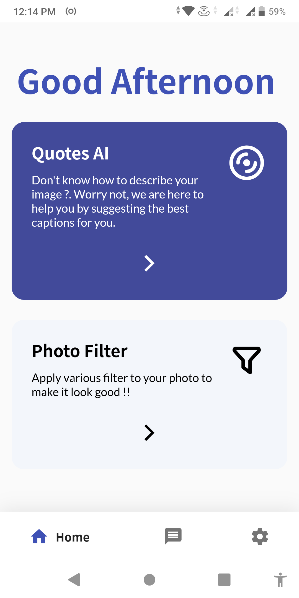
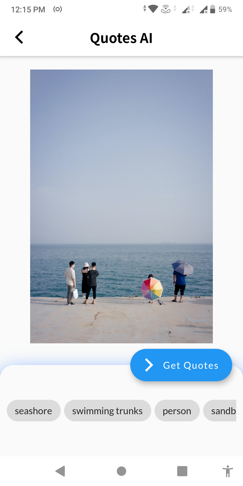
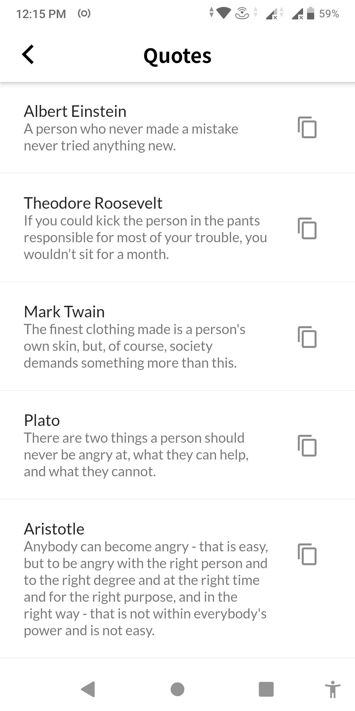
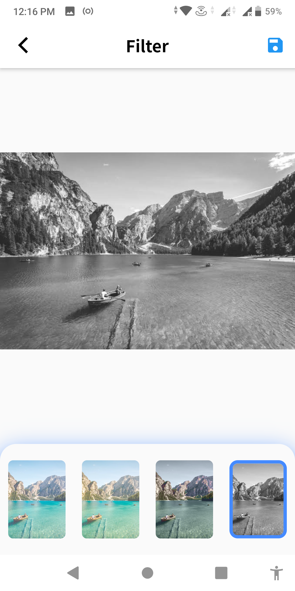

# Qpic

Qpic is an android app made by using <b>flutter</b> for getting quotes based on the object present in the image.

## Features

<ul>
<li>Search Quotes</li>
<li>Quotes based on Image</li>
<li>Image Color Filter</li>
<li>Copy Quotes</li>
</ul>

## Screenshots
</img>
</img>
</img>
</img>
</img>
</img>

## About Project
This application is made by using flutterv1.17.5. Flutter is based on dart programming language, you can learn dart from [here](https://dart.dev/guides).

For flutter documentation check out there official <a href="https://flutter.dev/docs">site</a>. 

For object detection we have used two types object detection model.

<ol>
<li>Mobilenet v1_1.0_224 tflite model with 1000 labels.</li>
<li>Yolo v2_tiny tflite model with 20 different classes.</li>
</ol>

## Contributing
Pull requests are welcome. For major changes, please open an issue first to discuss what you would like to change.

Please make sure to update tests as appropriate.